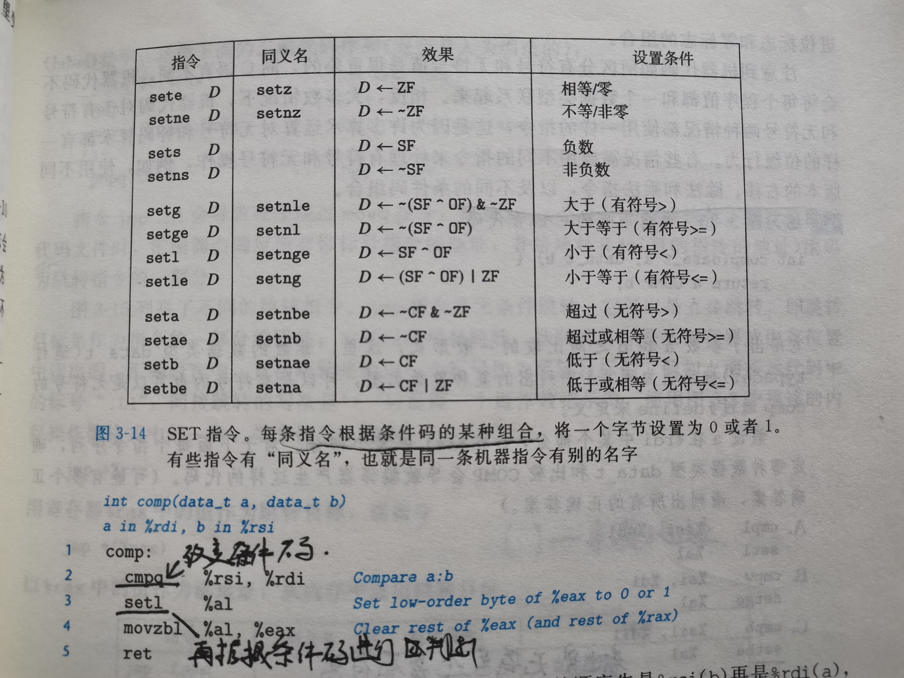
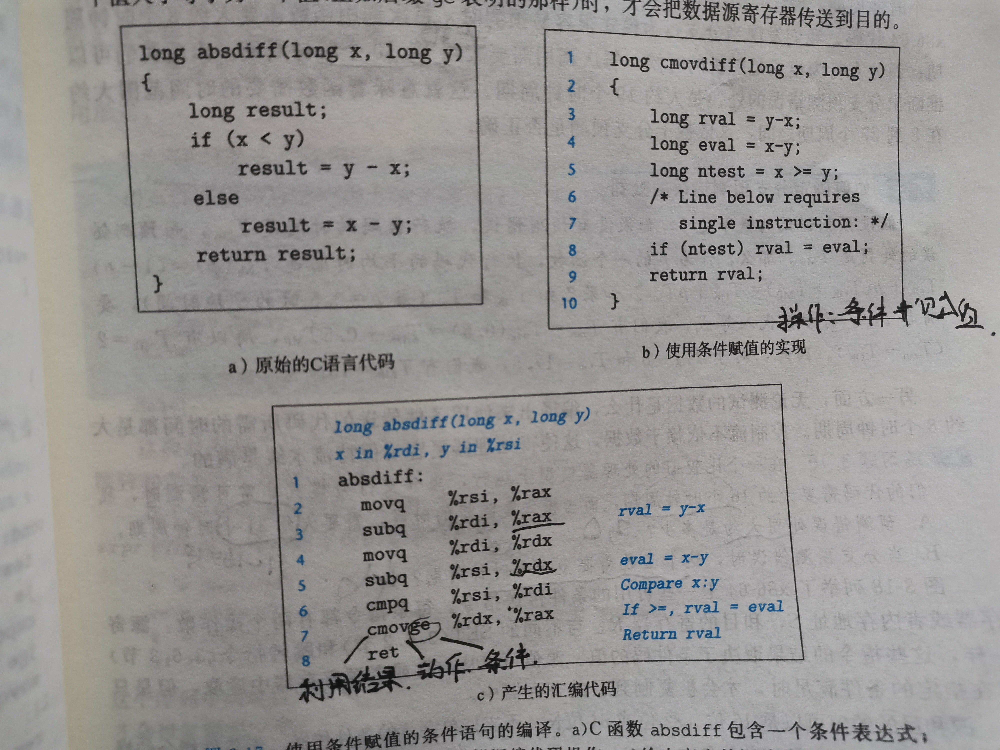
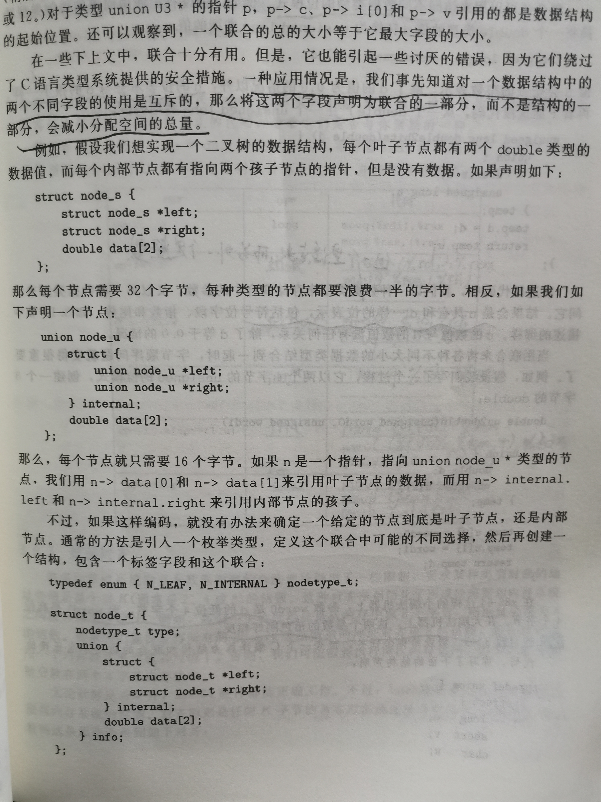

## 3.程序的机器级表示

> 具体的汇编指令可以看看王爽老师的《汇编原理》，非常地通俗易懂，零基础学习没问题

基本的指令就不记录了...以后复习汇编的时候可以开一个新专题

### 控制

#### 1.条件码

>CPU维护着一组单个位的条件码寄存器，它们描述了最近的算数或逻辑操作的属性。可以检测这些寄存器来执行条件分支指令，最常用：
>
>CF：进位标志，最近的操作使最高位产生了进位。对于非符号数来说,不存在溢出的问题,它的进位就相当于符号数中的溢出.
>
>ZF：零标志，最近的操作得出的结果为0。
>
>SF：符号标志，最近的操作得到的结果为0。
>
>OF：溢出标志，最近的操作导致一个补码溢出。而对于符号数来说,不存在进位的问题.两个正数相加(或一个正数减一个负数)得到负数,或是两个负数相加得到正数,就是溢出了.一个正数和一个负数相加不可能溢出。

#### 2.条件访问码

> 根据条件码的某种组合，将一个字节设置为0或1.

##### 用条件传送实现条件分支

> 计算一个条件操作的两种结果，然后再根据条件是否满足从中选取一个。

例如

通常的形式：

v = test-expr ? then-expr : else-expr

#### 汇编对循环代码的处理

> 感觉都do-while或者guarantee-do的汇编代码都挺好的理解的，很好地利用了goto代码风格

#### switch语句

> 根据一个整数索引值进行多重分支，主要是其中的跳转表利用（cs里面跳转表也挺多的）

**接下来是关于栈的一些知识点，可以去《菜鸡被pwn了》专题看看，理解了那个再看这儿就直接过关了**

#### 3.数组的分配和访问

利用lea指令进行地址的计算，将多维数组展开成一维

#### 4.异质的数据结构

**结构**：主要理解的是字节对齐 放个[连接](https://blog.csdn.net/lanzhihui_10086/article/details/44353381)

**联合**：大小为联合里面最大的数据类型，方便了节省内存嘞

#### 5.浮点代码的寄存器

略略略略略略略......