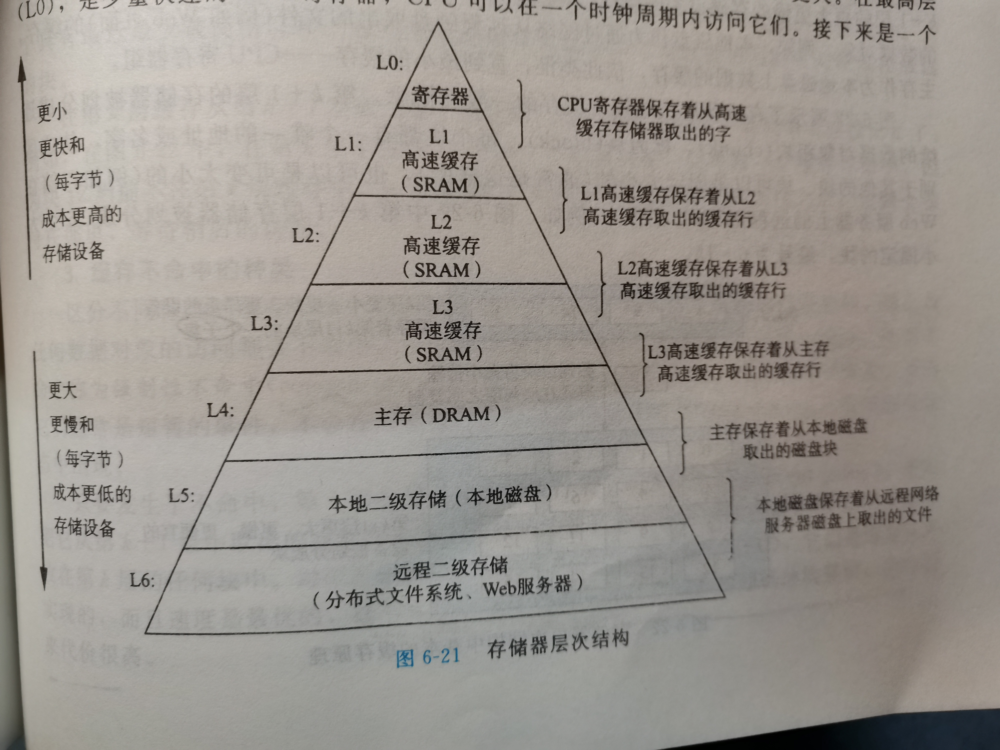

## 存储器层次结构

> 存储器系统是一个具有不同容量、成本和访问时间的存储设备的层次结构。CPU寄存器保存着最常用的数据。靠近CPU的小的，快速的高速缓存存储器作为一部分存储在相对慢速的主存储器中数据和指令的缓冲区域。主缓存存储在容量较大的，慢速磁盘上的数据，而这些磁盘常常又作为存储在通过网络连接的其他机器的磁盘或磁带上的数据的缓冲区域。

### 随机访问存储器

**静态RAM**

> 只有有电，它就会永远地保持它的值。即使有干扰(例如电子噪音)来扰乱电压，当干扰消除时，电路就会恢复到稳定值。

**动态RAM**

> DRAM将每个位存储为对一个电容的充电。

**传统的DRAM**

> 传统的DRAM芯片被分为d个超单元，组成为R x C的长方形矩阵，每个超单元由w位的大小

**内存模块**

> DRAM芯片封装在内存模块中，它插到主板的扩展槽上。

**增强的DRAM**

> 快页模式DRAM：FPM DRAM允许对同一行连续的访问可以直接从行缓冲区得到服务，原来就算是在缓存区中，也会从新读取
>
> 扩展数据输出DRAM：FPM DRAM的一个增强的形式，它允许各个CAS信号在时间上靠地更紧密一点
>
> 同步DRAM：SDRAM能够比那些异步的存储器更快地输出它的超单元内容
>
> 双倍数据速率同步DRAM：DDR SDRAM是SDRAM的增强。通过使用两个时钟沿作为控制信号，从而使DRAM的速度翻倍。
>
> 视频RAM：它用在图形系统的帧缓冲区中。

**非易失性存储器**

> PROM：只能被变编程一次
>
> 可擦写可编程ROM：可重复编程
>
> 闪存：是一类非易失性存储器，基于EEPROM。固态硬盘是基于闪存的磁盘驱动性

### 局部性

> 1.重复引用的变量的程序具有良好的时间局部性。
>
> 2.对于具有一定步长的引用模式的程序。步长越小，空间局部性越好。
>
> 3.对于取值指令来说，循环有好的时间和空间局部性。

### 存储器层次结构

### 高速缓存存储器

