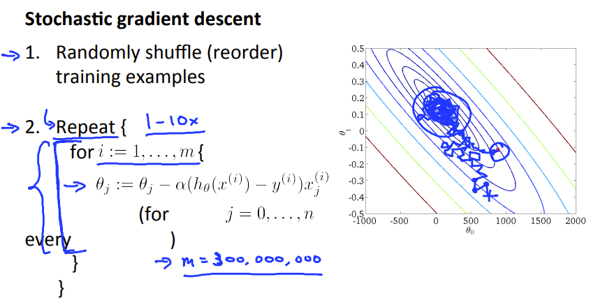

## Large scale machine learning

### Stochastic gradient descent

> 当训练集巨大的时候，使用原来的梯度下降方法会让计算变得非常昂贵。因为每此梯度下降都会因为求和而造成巨大的开销，而有一个解决方法是，Stochastic gradient descent

如上图所示，每次梯度下降时，只用一个样本，下降m次，然后重复上述步骤，这样的好处是，可以更快地靠近最优解。但画出的图表示，在这样的单次下降时，每次下降的方向可能不是最优解的方向，最后也是在最优解周围震荡，但是当样本量巨大时。最后的结果已经非常接近最优解，可以忽略这样的误差

### Mini-batch gradient descent

类似于 **Batch-gradient descent**和**Stochastic gradient descent**的折中

### Online learning

> 如果拥有大量的流量的话，讲每次浏览留下的记录作为一次结果，用完即弃，不占空间，但如果网站流量很小的话，还是得保存起来反复利用

### Map-reduce and data parallelism

简单来说就是将非时序性的计算(比如求和)放到不同的计算机上进行计算从而达到分散压力的目的

这里有推荐[Hadoop](https://hadoop.apache.org/)一个开源系统(还没用过)

