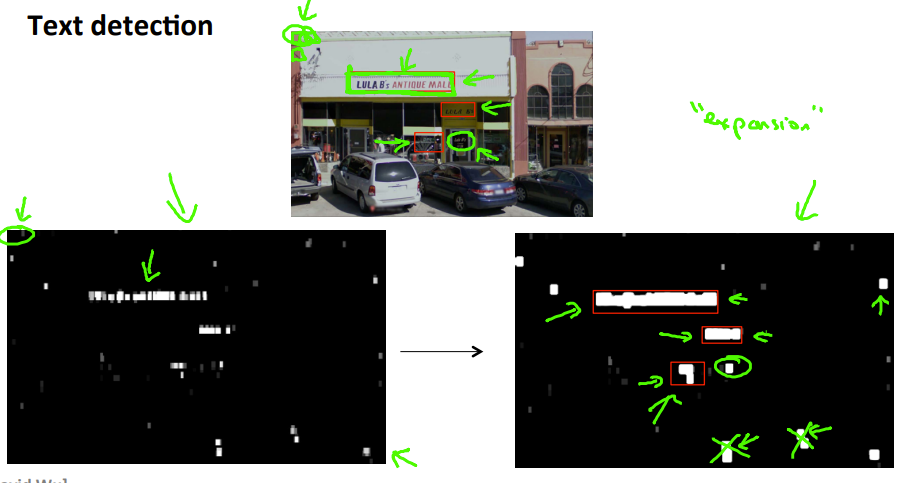

## Application example : Photo OCR

### problem description

> 比如我们想完成图片文字检测的操作，那我们最好将整个系统分成几个小步骤，分析是文字的探测，字符的分化，字符的识别。整个过程相当于一个流水线的生产

### Sliding windows

> 选择一个滑窗大小，选择一个步长，然后滑吖滑。再放大这个滑窗，然后再滑吖滑。
>
> 之后会得到一些滑窗留下的白窗，再对白窗进行扩张(有些灰的或者比例不对的可以discard了) 再把连在一起的框住，这就是我们识别出的文字区域

### Getting lots of data: Artificial data synthesis

- 如果是文字检测 可以去一些font-style网站，也可以给自己的训练集添加一些随机背景，或者真实情况的噪音

- 将图片进行空间变换
- 自己给数据集标上标签，有时候这不会花费多少的钱
- 进行外包，让其他人进行标签

### Ceiling analysis: What part of the pipeline to work on next

> 当我们训练好模型后，发现准确率有点低。我们可以以此给流水线模中的每个板块提供正确的，模拟成100%的预测，逐步观察预测率到最后的总的100%。期间，观察哪些模块的模拟使得最后的总预测大幅度增加，那么我们接下来的重心就是改善这个模块.

