## 多变量的线性回归

### 梯度下降

#### 多变量的线性方程

我们有以下的形式

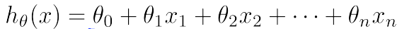

此时的亏损函数变成

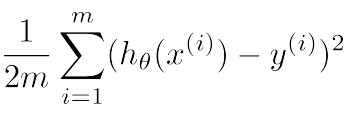

同时，进行梯度下降时

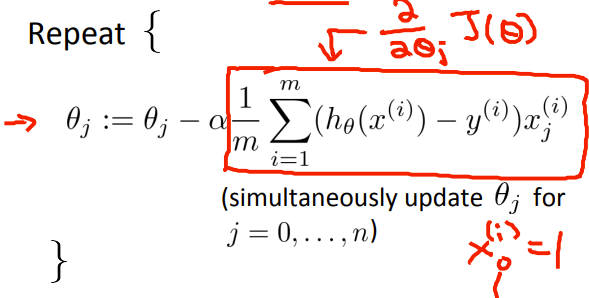

#### 关于特征范围

我们更倾向于将范围 [-1，1] 之间，接近这个范围也可以

> 这里的范围更多时特征的最大值减去最小值

例如： 一个 100~3000 的特征 我们改为x/2900来替换原来x。

> 这么做的原因是，当特征之间的范围差过大时，形成的等高线椭圆非常扁平，梯度下降得非常慢。
>
> 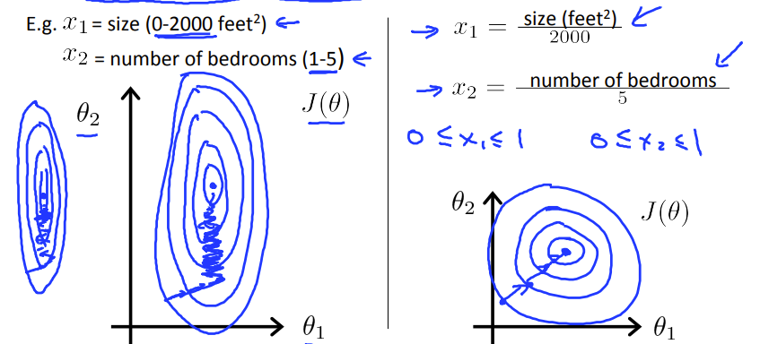

#### 关于α

我们可以图形化亏损函数和迭代次数之间的曲线关系，通过曲线图，改进α

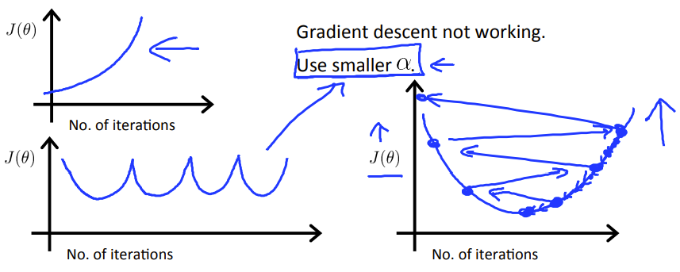

当去曲线图下降很慢是 可以考虑增大α

当曲线图上升或者重复跳跃时，可以减小α

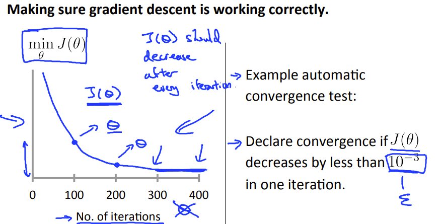

#### 特征和多项式回归

当特征之间有联系时，可以将多个特征化一个

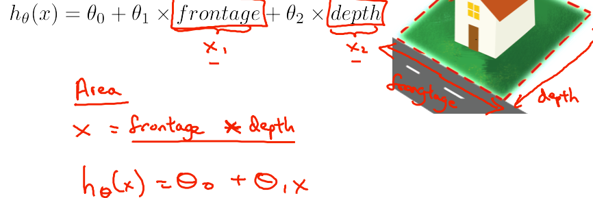

我们可以通多项式的方法，不断用多项式模拟逼近一个函数，直到我们满意为止。（有点类似于幂函数展开）

同时，将一元多项式回归变成多变量线性回归

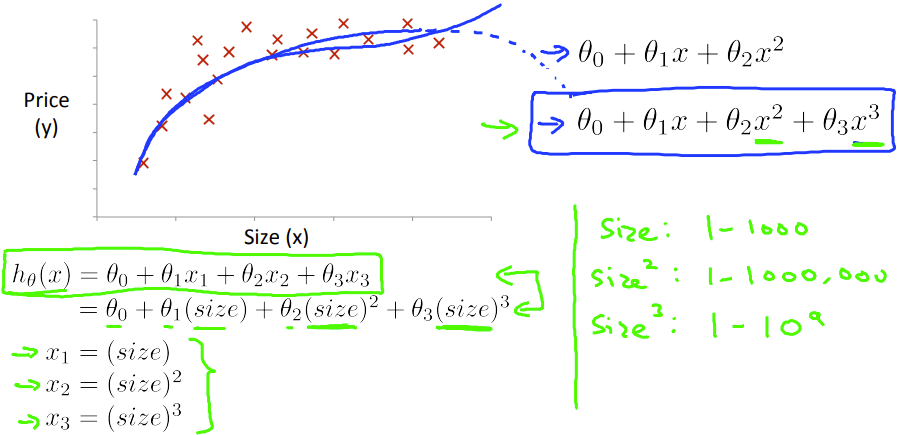

此方法同样适用于多元多项式回归

### 正规化方程

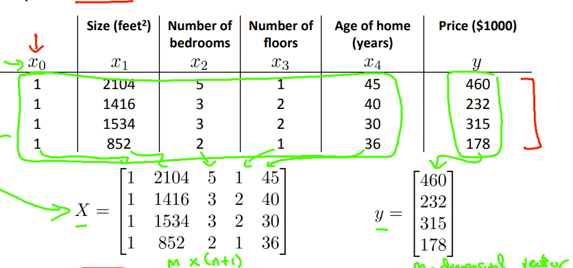

关于正规化方程，有两种的理解

> 1.变量的投影，近似解决一个没有解的方程。[一个佬的博客](https://blog.csdn.net/qq_32742009/article/details/81453505)

> 2.求偏导，利用线性代数求出，最后的结果也是近似，因为在空间变换过程中，向量进行了降维，损失了一些条件。

最后会有一个型如的等式

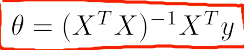

现在讨论这个式子，其中需要注意的一个点是，那个逆，是否存在（大多数都存在）

  不存在时：

​			1.存在线性相关的方程组（提出相关的方程）

​			2.行数小于列数（1）减少一些特征  （2）使用规范化

存在时注意，当m>n时，求出的解大多是近似最优解。

### 对比

| Gradient Descent           | Normal Equation                                         |
| :------------------------- | :------------------------------------------------------ |
| Need to choose alpha       | No need to choose alpha                                 |
| Needs many iterations      | No need to iterate                                      |
| O (kn^2*k**n*2)            | O (n^3*n*3), need to calculate inverse of X^TX*X**T**X* |
| Works well when n is large | Slow if n is very large                                 |

## Octave的使用（略）及   “Hello World”'

`不明白为什么 自己写的单特征和多特征的代码没啥差`

首先 通过load函数将 .dat/ .txt 中的数据读入Octave中 初始化theta

```octave
data = load('ex1data2.txt');
theta = zeros(3, 1);
```

再将特征和结果分别提取出来

```octave
X = data(:, 1:2);
y = data(:, 3);
m = length(y);
```

然后利用梯度下降进行线性回归

```octave
[theta, J_history] = gradientDescentMulti(X, y, theta, alpha, num_iters);%history是 为了方便绘图
```

其中gradientDescentMulti的定义为

```octave
function [theta, J_history] = gradientDescent(X, y, theta, alpha, num_iters)
m = length(y); % number of training examples
J_history = zeros(num_iters, 1);

for iter = 1:num_iters
    theta = theta - alpha/m*(X' * (X*theta-y))
    J_history(iter) = computeCost(X, y, theta);

	end
end
```

再将亏损函数进行可视化

```octave
plot(1:numel(J_history), J_history, '-b', 'LineWidth', 2);%其中numel返回矩阵的元素个数
xlabel('Number of iterations');
ylabel('Cost J');
```

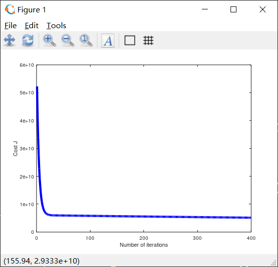

可以清楚地看到，亏损函数已经平滑

或者 我们直接使用正规化方程

```octave
function [theta] = normalEqn(X, y)
theta = zeros(size(X, 2), 1);
theta = pinv(((X')*X))*(X')*y;

end

```

在n比较小的时候 可以直接得出结果


另外，在放一下其几个个可视化的图片，方便以后给优化提供思路（单元）

```octave
plot(x, y, 'rx', 'MarkerSize', 5); 
hold on
xlabel("population")
ylabel("profit")


%% ============= Part 4: Visualizing J(theta_0, theta_1) =============
% Grid over which we will calculate J 亏损函数的图像
theta0_vals = linspace(-10, 10, 100);%将变量分割成小段
theta1_vals = linspace(-1, 4, 100);

% initialize J_vals to a matrix of 0's
J_vals = zeros(length(theta0_vals), length(theta1_vals));

% Fill out J_vals
for i = 1:length(theta0_vals)
    for j = 1:length(theta1_vals)
	  t = [theta0_vals(i); theta1_vals(j)];
	  J_vals(i,j) = computeCost(X, y, t); %给每次值“打点”
    end
end
% Because of the way meshgrids work in the surf command, we need to
% transpose J_vals before calling surf, or else the axes will be flipped
J_vals = J_vals';
% Surface plot
figure;
surf(theta0_vals, theta1_vals, J_vals)
xlabel('\theta_0'); ylabel('\theta_1');


% Contour plot  等高线的图像
figure;
% Plot J_vals as 15 contours spaced logarithmically between 0.01 and 100
contour(theta0_vals, theta1_vals, J_vals, logspace(-2, 3, 20)) %Return a row vector with N elements logarithmically spaced from 10^A to 10^B.
xlabel('\theta_0'); ylabel('\theta_1');
hold on;
plot(theta(1), theta(2), 'rx', 'MarkerSize', 10, 'LineWidth', 2);
```


