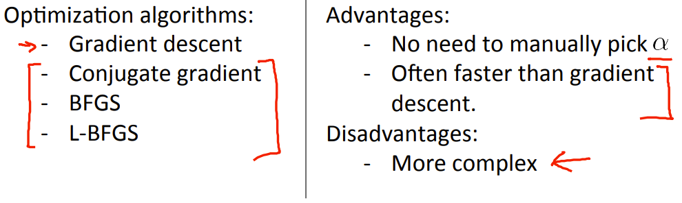
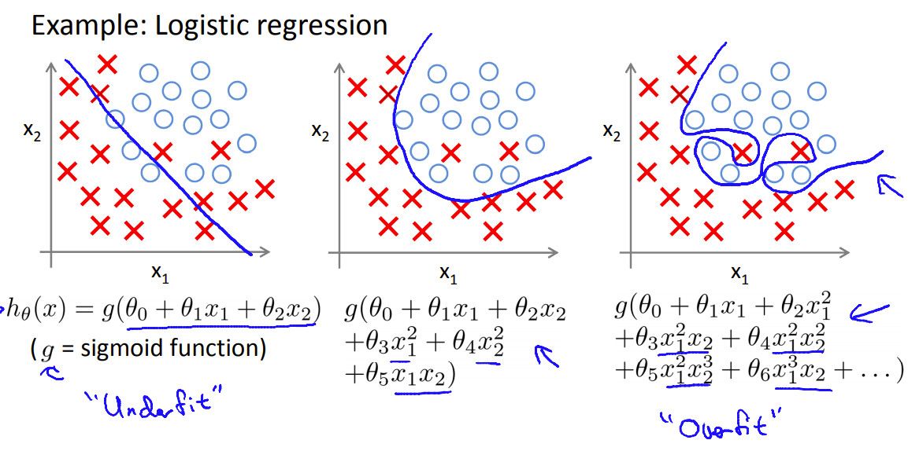
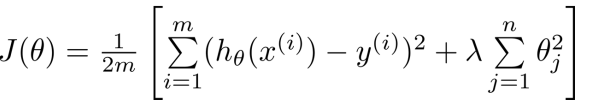

## 逻辑回归及regularization(防止overfitting)

> 逻辑回归又叫分类回归(自己翻译可能不对)，特点是结果是有限的离散的，模拟出的结果是某个值的可能性。这里只用俩个值为例
>
> 
>
> 经常，将可能性>=0.5时判断为1，<0.5时判断为-1

### Sigmoid function

> 因为原h(theta,X)计算出的值可以是任意的，所以应该将范围限制在0-1之内，Sigmoid函数的作用就是加权压缩。更多的想法可以看看[3b1b的deep_learning](https://www.bilibili.com/video/BV1bx411M7Zx)

```octave
z = theta' * x
g=1 ./ (1+exp(-z));
```

### Cost function

> 如果按照原来的平方形式作为亏损函数，那么会得到非常多的局部最优解，且根据初始值来确定最后的模拟结果，所以换了一种亏损函数的形式
>
> 

```octave
J = sum(-y'*log(h)-(1-y)'*log(1-h))/m
```


### Gradient descent


```octave
h=sigmoid(X*theta);%计算出每个样例的估计值
grad=((h-y)' * X)/m;算出一次的更新
```

然后剩下的是一些高级算法优化，学完了再回头过来看看



### 当有3个及以上的离散值时

> 为每个class i 都训练一个h(i)，预测结果时，将每个h都尝试一遍，选出预测值最大的class作为结果。训练的具体是，将该 i 作为一个值，剩下的全看为other，回到俩个class 的逻辑回归的训练

## Overfitting

> 过拟合是因为为了拟合训练数据，加了很多的特征，导致最后的模拟函数能很好地预测训练数据，但对于未知数据的拟合效果很差




其中能发生的过拟合的原因是，加入太多的幂次特特征，导致了类似泰勒展开的结果

**解决方法**

>1.减少一些特征值：(1)手动选择哪些特征值需要保留 (2)利用模型选择算法(之后会提)
>
>2.正规化：保留多余的特征，但减小theta的值

#### Regularization



在亏损函数中加入theta(除0)的平方项来防止过拟合，因为求偏导后会产生类似


的结果，当lambda，m，alpha均大于0时，相当于每次theta均在变小。

>**过拟合的时候，拟合函数的系数往往非常大，为什么？过拟合，就是拟合函数需要顾忌每一个点，最终形成的拟合函数波动很大。在某些很小的区间里，函数值的变化很剧烈。这就意味着函数在某些小区间里的导数值（绝对值）非常大，由于自变量值可大可小，所以只有系数足够大，才能保证导数值很大。而正则化是通过约束参数的范数使其不要太大，所以可以在一定程度上减少过拟合情况**

在**线性回归中**

```octave
%梯度下降
J=sum((X*theta-y).^2)/(2*m) + (lambda/(2*m)) * sum(theta.^2);
grad = -alpha/m*(X' * (X*theta-y)) - (alpha*lambda)/m*(theta')


%正规化方程
E = diag(ones(n+1,1),zeros(n+1,n+1))%生成单位对角阵
theta = pinv((X'*X + lambda*E))X'y
```

在**逻辑回归中**

```octave
h = sigmoid(X*theta)

theta(1,1) = 0;%不将theta0考虑进去
J=sum(-y'*log(h)-(1-y)'*log(1-h))/m + (lambda/(2*m)) * sum(theta.^2);
%J=sum(-y'*log(h)-(1-y)'*log(1-h))/m+lambda/2/m*sum(power(theta,2));
grad=((h-y)'*X)/m+lambda/m*(theta');
theta(1,1) = ((h-y)' * X(:,1))/m;%分别计算theta0
```

一个画画的函数

```octave
function plotDecisionBoundary(theta, X, y)
%PLOTDECISIONBOUNDARY Plots the data points X and y into a new figure with
%the decision boundary defined by theta
%   PLOTDECISIONBOUNDARY(theta, X,y) plots the data points with + for the 
%   positive examples and o for the negative examples. X is assumed to be 
%   a either 
%   1) Mx3 matrix, where the first column is an all-ones column for the 
%      intercept.
%   2) MxN, N>3 matrix, where the first column is all-ones

% Plot Data
plotData(X(:,2:3), y);
hold on

if size(X, 2) <= 3
    % Only need 2 points to define a line, so choose two endpoints
    plot_x = [min(X(:,2))-2,  max(X(:,2))+2];

    % Calculate the decision boundary line
    plot_y = (-1./theta(3)).*(theta(2).*plot_x + theta(1));

    % Plot, and adjust axes for better viewing
    plot(plot_x, plot_y)
    
    % Legend, specific for the exercise
    legend('Admitted', 'Not admitted', 'Decision Boundary')
    axis([30, 100, 30, 100])
else
    % Here is the grid range
    u = linspace(-1, 1.5, 50);
    v = linspace(-1, 1.5, 50);

    z = zeros(length(u), length(v));
    % Evaluate z = theta*x over the grid
    for i = 1:length(u)
        for j = 1:length(v)
            z(i,j) = mapFeature(u(i), v(j))*theta;
        end
    end
    z = z'; % important to transpose z before calling contour

    % Plot z = 0
    % Notice you need to specify the range [0, 0]
    contour(u, v, z, [0, 0], 'LineWidth', 2)
end
hold off

end


function out = mapFeature(X1, X2)
% MAPFEATURE Feature mapping function to polynomial features
%
%   MAPFEATURE(X1, X2) maps the two input features
%   to quadratic features used in the regularization exercise.
%
%   Returns a new feature array with more features, comprising of 
%   X1, X2, X1.^2, X2.^2, X1*X2, X1*X2.^2, etc..
%
%   Inputs X1, X2 must be the same size
%

degree = 6;
out = ones(size(X1(:,1)));
for i = 1:degree
    for j = 0:i
        out(:, end+1) = (X1.^(i-j)).*(X2.^j);
    end
end

end
```

