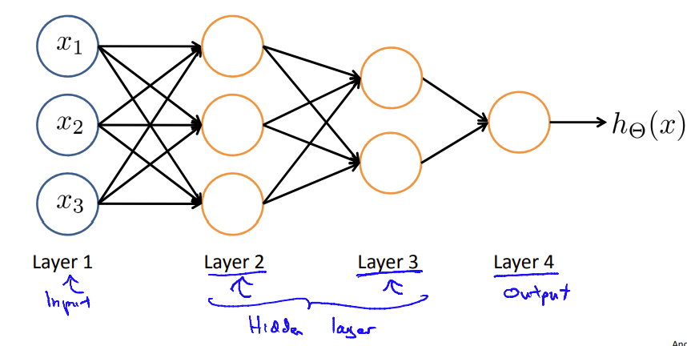
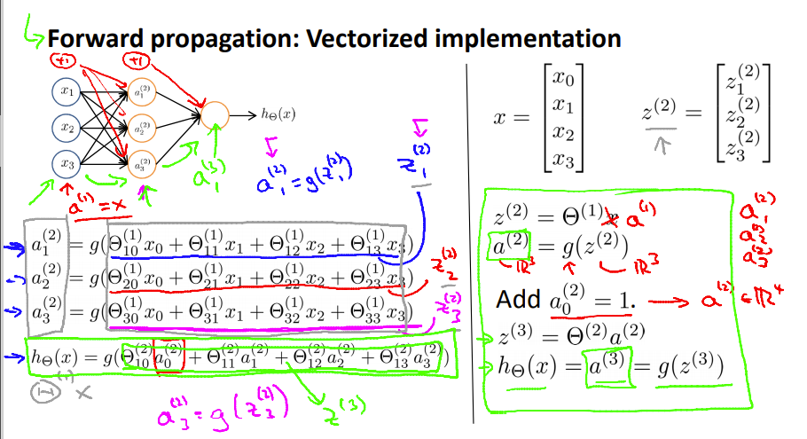

## Neural Networks : Representation

### 概念

（略）

### Model representation

> 神经网络大抵分为3个部分，为输入层，隐藏层，输出层。其中，输入层输入数据，隐藏层对使用者不可见，输出层输出结果进行预测。
>
> 

关于隐藏层的一种解释是，实现了简单函数的叠加，最终成为了一个十分复杂的预测函数。也可以理解为，先识别出图像的部分特征，再将部分特征组合进行新的预测，最后得到结果 来自[3b1b](https://www.bilibili.com/video/BV1bx411M7Zx/)

### 关于如何向前传播



**代码为**(只有三层)

```octave
X_ = [ones(m,1) X];
[a,p] = max(sigmoid([ones(m,1) sigmoid(X_*Theta1')]*Theta2'),[],2); %return the max and the index of the max
```

### 当输出为图像时的处理

> 判断图片的大小，直接将每个像素作为特征进行训练。

**训练**（其中fmincg为文件自带函数）

```octave
load('ex3data1.mat'); % training data stored in arrays X, y
%load the data

initial_theta = zeros(n + 1, 1);
for i = 1:num_labels
  options = optimset('GradObj','on','MaxIter',50); %"on" represent that specifies the Func, and the max_num of iteration is 50
  all_theta(i,:) = (fmincg(@(t)(lrCostFunction(t,X,(y ==i),lambda)),initial_theta, options))'; %Optimize the each row-theta of each layer
endfor
```

**预测**

```octave
[a,p] = max(sigmoid(X*all_theta'),[],2); % the p is the position
```

