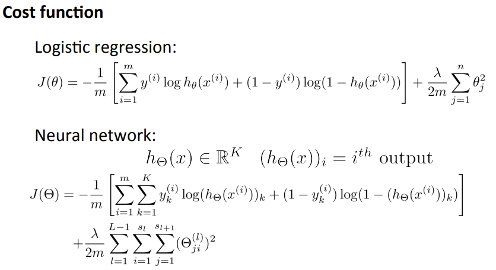
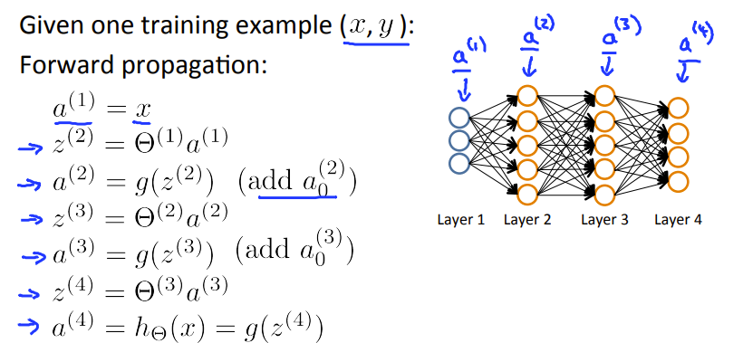
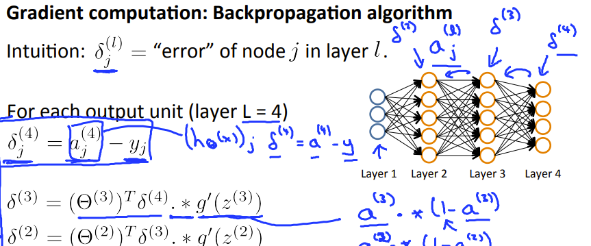
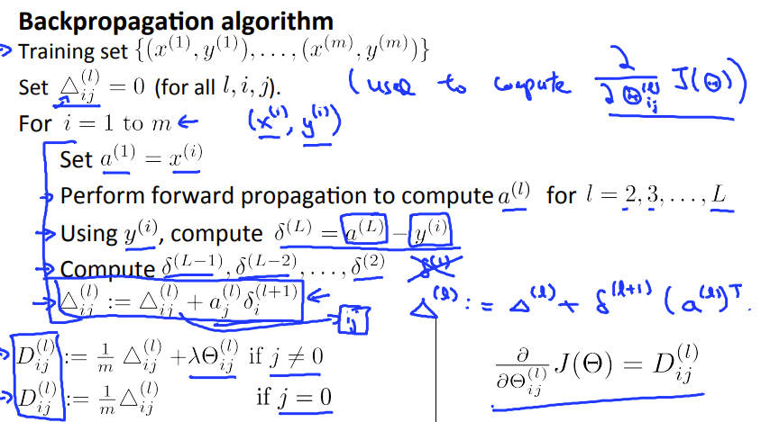

## Neural Networks : Learning

### Cost funciton

> 不同的结果用总维数的基向量表示，[0,0,...,0,1,0,...,0].



在Octave中的代码为

```octave
J = 1/m*sum(sum(-yk.*log(h')-(1-yk).*log(1-h')));
r = (lambda/2/m) * (sum(sum(Theta1(:,2:end).^2))+sum(sum(Theta2(:,2:end).^2)));
J = J+r;
```

### Backpropagation algorithm

> 正向传播一下，在反向传播回来，最终是算出损失函数对某个Theta的偏导

**正向传播一下**：



**在反向传播一下**：





Octave的代码为：

```octave
%Theta1 is 25 x 401
%Theta2  is 10 x 26
for i = 1:m,
    a1 = X(i,:); %forwording popagation a1 is 1 x 401
    z1 = Theta1 * a1'; % z1 is 25 x 1
    a2 = [1;sigmoid(z1)]; % a2 is 26 x 1;
    z2 = Theta2 * a2; % z2 is 10 x 1;
    h = sigmoid(z2);
    y = yk(i,:);
    %backpropagation
    delta3 = h - y';  %delta3 is a 10 x 1 column vector
    delta2 = Theta2(:,2:end)' * delta3 .* sigmoidGradient(z1);  % delta2 is a 25 x 1 column vector;
    Theta1_grad = Theta1_grad + delta2 * a1;  %25 x 401
    Theta2_grad = Theta2_grad + delta3 * a2'; %10 X 26
endfor
Theta1(:,1) = 0; % eliminate the bias factor
Theta2(:,1) = 0;

Theta1_grad = Theta1_grad ./ m + lambda/m * Theta1;
Theta2_grad = Theta2_grad ./ m + lambda/m * Theta2;

```

其中 sigmoidGradient为(求导得出再带入sigmoid函数)

```octave
g=sigmoid(z) .* (1-sigmoid(z));
```


%其中 Theta1(:,1) = 0;Theta2(:,1) = 0; 是为了不对bias进行正规化

如果对公式来源感兴趣，可以看看 一个佬的文章[神经网络，BP算法的理解与推导](https://zhuanlan.zhihu.com/p/45190898)

### Implementation note : Unrolling

在fminunc中最好传入的是展开的Theta，再在损失函数中恢复Theta的样子

> If the dimensions of Theta1 is 10x11, Theta2 is 10x11 and Theta3 is 1x11

**Unrolling**：

```octave
thetaVector = [ Theta1(:); Theta2(:); Theta3(:); ]
deltaVector = [ D1(:); D2(:); D3(:) ]
```

**Reshape**:

```octa
Theta1 = reshape(thetaVector(1:110),10,11)
Theta2 = reshape(thetaVector(111:220),10,11)
Theta3 = reshape(thetaVector(221:231),1,11)

```

### Gradient Checking

> 梯度检验是检验我们的神经网络模型是否可行，操作为判断梯度检验的结果是否和反向传播算法的结果是否相近，相近的话很大程度上证明了模型是正确的。
>
> tips：梯度检验正确后一定要记得关掉它，因为计算它的速度很慢

```octave
epsilon = 1e-4;
for i = 1:n,
  thetaPlus = theta;
  thetaPlus(i) += epsilon;
  thetaMinus = theta;
  thetaMinus(i) -= epsilon;
  gradApprox(i) = (J(thetaPlus) - J(thetaMinus))/(2*epsilon)
end;
```

### Random Initialization

> 因为如果最开始的Theta参数一致，由于对称性，修正过的参数也一致。不能模拟复杂的函数。

```octave
%If the dimensions of Theta1 is 10x11, Theta2 is 10x11 and Theta3 is 1x11.

Theta1 = rand(10,11) * (2 * INIT_EPSILON) - INIT_EPSILON;
Theta2 = rand(10,11) * (2 * INIT_EPSILON) - INIT_EPSILON;
Theta3 = rand(1,11) * (2 * INIT_EPSILON) - INIT_EPSILON;

```

