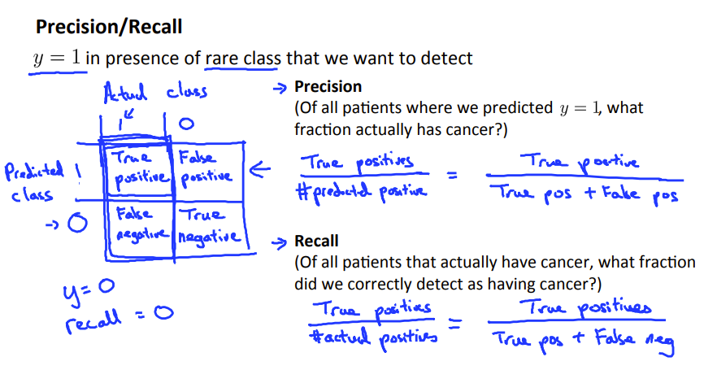

## Advice for applying machine learning

### Deciding what to try next

当出现大量误差时，下一步应该做什么

> 1.获得更多的训练集
>
> 2.将缩小特征集（也许是过拟合的情况发生了）
>
> 3.添加新的特征（欠拟合的情况）
>
> 4.增大或者减小lambda

应该如何选择呢，现在应该对我们的**假设进行评估**

> 很重要的是，思考一下，从人类专家的角度，给你这些特征，你能准确地得出结果吗？考虑哪些特征是必要的。

首先，将所有的数据集分为**训练集**，**交叉检验集**和**测试集**，其中训练集用来训练参数，交叉检验集用来检测模型的可行性，测试集来显示误差的一般化

其次，定义的误差为（注意在这些表达式中均没有加人正则项）

> 对于逻辑回归，h-y = 1或者0；

设值d为特征的次方数，根据不同的的，通过训练集选择不同的聚合的Theta，再将Theta带入交叉验证集中，见哪一个的Jcv最小，选出合适的p。具体**代码**：

```octave
function [X_poly] = polyFeatures(X, p)
x1 = size(X,1);
x2 = size(X,2);

X_poly = zeros(x1, x2*p);

for i = 1:p,
    X_poly(:,(i-1)*x2+1:i*x2) = X.^i;
endfor

error_train = zeros(p, 1);
error_val = zeros(p, 1);
for i = 1:p,
	theta = trainLinearReg(polyFeatures(X, p),y,0);
	error_train(i) = linearRegCostFunction(polyFeatures(X, p),y,theta,0);
	error_val(i) = linearRegCostFunction(polyFeatures(Xval, p),yval,theta,0);
endfor
```


其中 **trainLinearReg**

```octave
function [theta] = trainLinearReg(X, y, lambda)

initial_theta = zeros(size(X, 2), 1); 
costFunction = @(t) linearRegCostFunction(X, y, t, lambda);


options = optimset('MaxIter', 200, 'GradObj', 'on');

% Minimize using fmincg
theta = fmincg(costFunction, initial_theta, options);

end

```

**linearRegCostFunction**

```octave
function [J, grad] = linearRegCostFunction(X, y, theta, lambda)
m = length(y);

J = 0;
grad = zeros(size(theta)); %theta 2x1


J = 1/(m*2)*sum(sum((X*theta - y).^2)) + lambda/(2*m)*sum(sum(theta(2:end,:).^2));
temp = theta;
temp(1,1) = 0;
grad  = (1/m)*(X' * (X*theta-y)) + lambda/m*temp;

grad = grad(:);
end
```

在特征进行高次方后，记得进行标准化

```octave
function [X_norm, mu, sigma] = featureNormalize(X)

mu = mean(X);
X_norm = bsxfun(@minus, X, mu);

sigma = std(X_norm);
X_norm = bsxfun(@rdivide, X_norm, sigma);


end

```


比较出好的p之后，再选择”优秀“的**lambda**

```octave
function [lambda_vec, error_train, error_val] = ...
    validationCurve(X, y, Xval, yval)

lambda_vec = [0 0.001 0.003 0.01 0.03 0.1 0.3 1 3 10]'  ;
error_train = zeros(length(lambda_vec), 1);
error_val = zeros(length(lambda_vec), 1);

for i = 1:length(lambda_vec),
    lambda = lambda_vec(i);
    theta = trainLinearReg(X,y,lambda);
    error_train(i) = linearRegCostFunction(X,y,theta,0);
    error_val(i) = linearRegCostFunction(Xval,yval,theta,0)
endfor
end

```


### Diagnosing bias vs variance(欠拟合和过拟合)

> 通过比较J_train 和 J_cv之间的差值，在J_cv都很高的时候，如果俩者相似，说明模型也没有很好的拟合训练集，若J_cv >> J_train，说明很好的拟合的训练集，但是发生了过拟合
>
> 

### Learning curves(不同情况下 的)

三张图划水


**世界线收束**

> 1.获得更多的训练集 : 过拟合或者欠拟合
>
> 2.将缩小特征集（也许是过拟合的情况发生了）
>
> 3.添加新的特征（欠拟合的情况）
>
> 4.增大或者减小lambda （欠拟合  /  过拟合）

## Machine learning system design

### Prioritizing what to work on Spam classification example

如何区分垃圾邮件？可以从内容下提取特征，比如“买”，“卖”，“打折”等词。最好不要人为提取，可以去训练集中收集成千上万个特征。

>1.收集大量的数据
>
>2.在邮件路由消息中提取更精细的特征
>
>3.改善信息内容中的特征。时态，同义词
>
>4.修正一些拼写错误

### Error analysis

> 1.选一个简单的，能快速完成的算法，完成它，然后用交叉验证进行测试
>
> 2.将学习曲线画出来决定是否需要更多的数据，特征等。
>
> 3.错误分析，通过手动检测那些预测错误的交叉检验集。看是否存在哪些趋势导致这些检验出现错误。

手动检验错误，并且将它们分类


并且对其中的最明显的趋势进行改善，最后通过数值分析检测效果

### skewed classes

> 当训练集中出现大量的标签为（y=1）或者（y=0）的数据时(例如癌症的判断)，会产生偏移类类型的误差。我们用精确率和召回率表示。
>
> 

### Trading off precision and recall

通过改变判断的临界值，可以分别提高精确率或者召回率。

同时 根据 判断权衡是否得当

### Data for machine learning

> “It’s not who has the best algorithm that wins. It’s who has the most data.”


**Use a very large training set (unlikely to overfit)**

