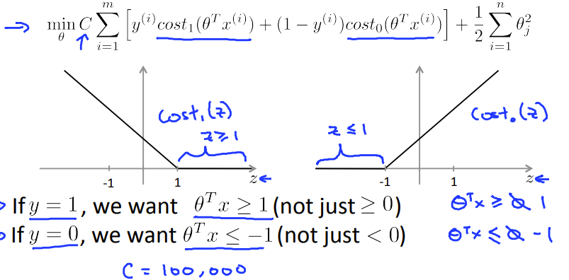
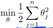
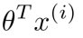
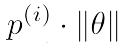
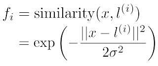
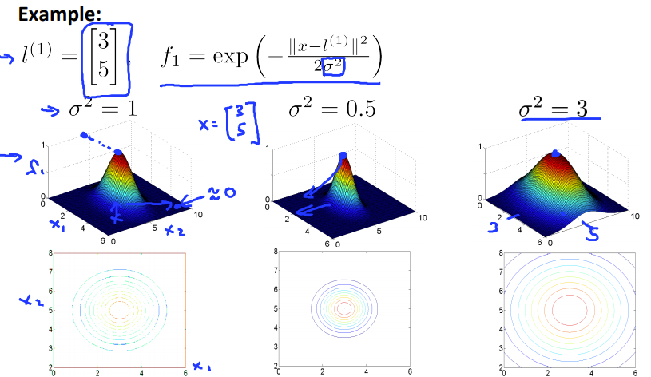
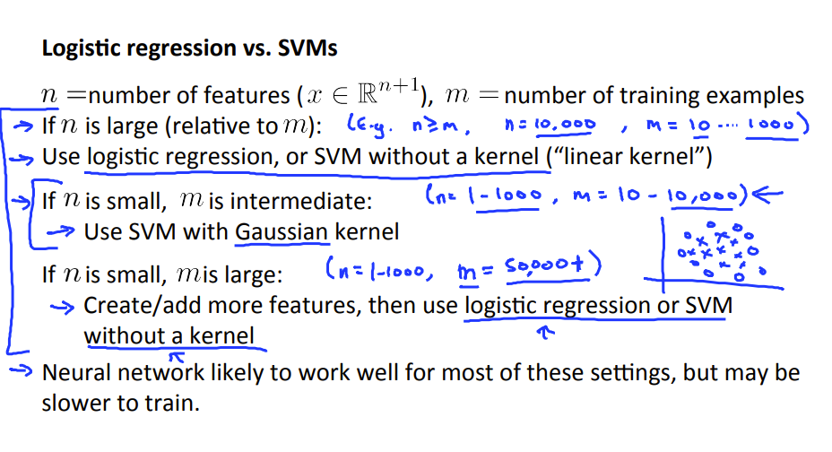
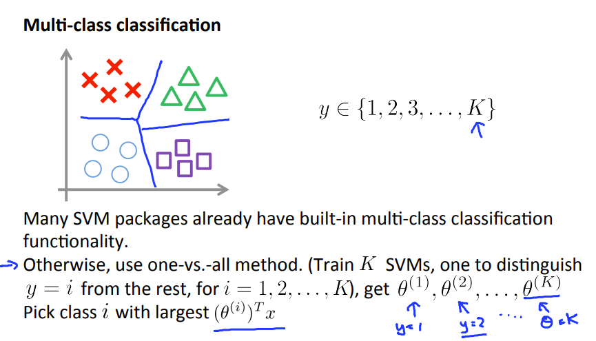

## Support Vector Machines

### Optimization object

> 因为支持向量机的算法由自己写出的话比较慢，效率不高，所以大部分都用的是别人开发好的库，然后...好像变得方便起来了

```octave
model= svmTrain(X, y, C, @(x1, x2) gaussianKernel(x1, x2, sigma));
```

具体理解过程就不写了...可以看看原视频 得出的亏损函数就是



感觉像是那个线性整流函数 ReLU 一部分模仿了生物学上的神经元什么时候会激发 

其中C是类似的于正则化的lambda 不过是它的倒数罢惹

### Large margin classification

> 支持向量机又叫大间距分类。意思为，得出的边界线倾向于和训练集距离最大，下面进行半定性半定量分析。

1.假定有Theta‘ *  X > 1 if y = 1           Theta‘ *  X < -1 if y = 0;  最后成为

其中     =     其中p为x在theta上的投影

所以当Theta的平方和很小的时候，要求x在Theta向量上的投影距离尽量的大，可视化后就是Theta向量尽量靠近训练集，而分界线和Theta垂直，所以形成了的大间距分类。

### Kernels

> 看到的一个说法是，核函数是一个从低维空间到高维空间的映射，在低维中不可线性分割的点，在高维中变得可以线性分割，虽然最后投影回去不再是线性，但是在高维的时候已经减少了计算量。

**常见的核函数**

> 1. 线性：K ( v 1 , v 2 ) = < v 1 , v 2 > K(v_1,v_2)=<v_1,v_2>*K*(*v*1,*v*2)=<*v*1,*v*2>
> 2. 多项式：K ( v 1 , v 2 ) = ( γ < v 1 , v 2 > + c ) n K(v_1,v_2)=(\gamma<v_1,v_2>+c)^n *K*(*v*1,*v*2)=(*γ*<*v*1,*v*2>+*c*)*n*
> 3. Sigmoid ：K ( v 1 , v 2 ) = tanh ⁡ ( γ < v 1 , v 2 > + c ) K(v_1,v_2)=\tanh(\gamma<v_1,v_2>+c)*K*(*v*1,*v*2)=tanh(*γ*<*v*1,*v*2>+*c*)
> 4. Radial basis function ：K ( v 1 , v 2 ) = exp ⁡ ( − γ ∣ ∣ v 1 − v 2 ∣ ∣ 2 ) K(v_1,v_2)=\exp(-\gamma||v_1-v_2||^2)*K*(*v*1,*v*2)=exp(−*γ*∣∣*v*1−*v*2∣∣2)

常用的核函数就是linear和高斯了 也许可以构建 但必须满足**Mercer's Theorem**

这里讨论一下高斯核函数的用法



```octave
sim = exp(-sum((x1-x2).^2)/2/(sigma^2));
```


其中的 l 是标记，其实就等于我们的一个训练样本，x为预测点。

sigma是一个常数，控制着假设的拟合情况

当sigma过小的时候，容易发生过拟合，反之过大的时候容易欠拟合

> 关于利用相似度来预测结果，一个直观的解释是，当预测点靠近一个为正的点时，表明这两个点相似，相似度接近一，而和其他点的相似度为0，因此预测点更可能计算出为正。依此，在所有为正的区域都划分出一个范围，在这个范围内，预测点都被认为是正的。

选择sigma和C的代码

```octave
wid=[0.01;0.03;0.1;0.3;1;3;10;30];
errors=0;
for i=1:size(wid,1)
	for j=1:size(wid,1)
		model= svmTrain(X, y, wid(i), @(x1, x2) gaussianKernel(x1, x2, wid(j)));
		predictions=svmPredict(model, Xval);
		errors(i,j)=mean(double(predictions ~= yval));
	endfor
endfor
%the C and sigma both need to be chosen;
error=min(min(errors));
[i,j]=find(errors==error);
C=wid(i);
sigma=wid(j);
```


关于一些建议

>n是特征的个数，m为训练集的个数。
>
>1.如果n很大的话(接近m):使用逻辑回归或者线性核函数的SVM
>
>2.如果n小小的，m中等使用高斯核函数的SVM
>
>3.如果n很小，m很大的话: 创建或者添加更多的特征，然后使用逻辑回归或者线性核函数的SVM
>
>4.神经网络对于大多数的背景设置的效果可能更好，但是训练得很慢。



**一个垃圾邮件分类的例子**

主要是处理训练邮件和将特征转化成数据形式

```octave
function word_indices = processEmail(email_contents)
%PROCESSEMAIL preprocesses a the body of an email and
%returns a list of word_indices 
%   word_indices = PROCESSEMAIL(email_contents) preprocesses 
%   the body of an email and returns a list of indices of the 
%   words contained in the email. 
%

% Load Vocabulary
vocabList = getVocabList();

% Init return value
word_indices = [];

% ========================== Preprocess Email ===========================

% Find the Headers ( \n\n and remove )
% Uncomment the following lines if you are working with raw emails with the
% full headers

% hdrstart = strfind(email_contents, ([char(10) char(10)]));
% email_contents = email_contents(hdrstart(1):end);

% Lower case
email_contents = lower(email_contents);

% Strip all HTML
% Looks for any expression that starts with < and ends with > and replace
% and does not have any < or > in the tag it with a space
email_contents = regexprep(email_contents, '<[^<>]+>', ' ');

% Handle Numbers
% Look for one or more characters between 0-9
email_contents = regexprep(email_contents, '[0-9]+', 'number');

% Handle URLS
% Look for strings starting with http:// or https://
email_contents = regexprep(email_contents, ...
                           '(http|https)://[^\s]*', 'httpaddr');

% Handle Email Addresses
% Look for strings with @ in the middle
email_contents = regexprep(email_contents, '[^\s]+@[^\s]+', 'emailaddr');

% Handle $ sign
email_contents = regexprep(email_contents, '[$]+', 'dollar');


% ========================== Tokenize Email ===========================

% Output the email to screen as well
fprintf('\n==== Processed Email ====\n\n');

% Process file
l = 0;

while ~isempty(email_contents)

    % Tokenize and also get rid of any punctuation
    [str, email_contents] = ...
       strtok(email_contents, ...
              [' @$/#.-:&*+=[]?!(){},''">_<;%' char(10) char(13)]);
   
    % Remove any non alphanumeric characters
    str = regexprep(str, '[^a-zA-Z0-9]', '');

    % Stem the word 
    % (the porterStemmer sometimes has issues, so we use a try catch block)
    try str = porterStemmer(strtrim(str)); 
    catch str = ''; continue;
    end;

    % Skip the word if it is too short
    if length(str) < 1
       continue;
    end

    for i=1:length(vocabList)
        if strcmp(str, vocabList{i})==1
            word_indices=[word_indices;i]
        end
    end
    % Print to screen, ensuring that the output lines are not too long
    if (l + length(str) + 1) > 78
        fprintf('\n');
        l = 0;
    end
    fprintf('%s ', str);
    l = l + length(str) + 1;
end

% Print footer
fprintf('\n\n=========================\n');
end

```

```octave
function x = emailFeatures(word_indices)
%EMAILFEATURES takes in a word_indices vector and produces a feature vector
%from the word indices
%   x = EMAILFEATURES(word_indices) takes in a word_indices vector and 
%   produces a feature vector from the word indices. 

% Total number of words in the dictionary
n = 1899;

% You need to return the following variables correctly.
x = zeros(n, 1);

for i = 1:length(word_indices),
    x(word_indices(i)) = 1; % i could be the index;
endfor


% =========================================================================
    

end

```

对了  预测是直接Theta乘以相似度向量的值 看和0的关系，大于为1，小于为0。如果有很多个类，则用实数划分

