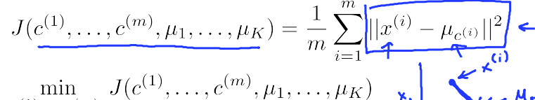
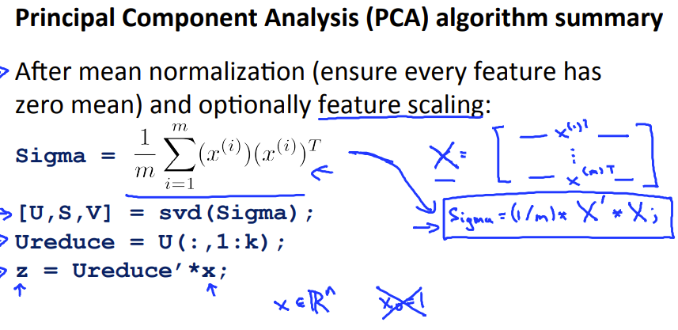
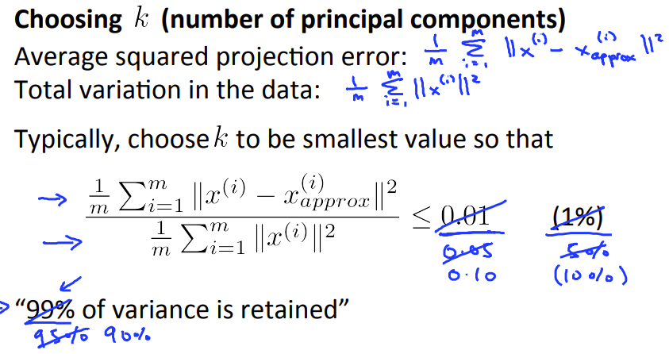
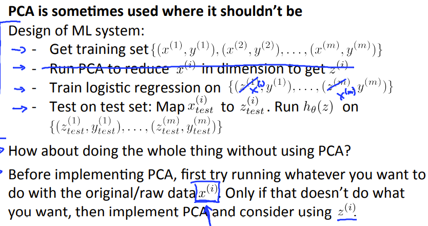

## Clustering

开始非监督机器学习辽

### K-means algorithm

大致**步骤**

> 1.选取要分的类的K个数，随机初始化K各个点为初始聚合点
>
> 2.比较样点和聚合点的距离，建立一个新的向量，在相应的位置标记最近距离点的代号
>
> 3.更新聚合点的值，等于其所有标记点的平均值。
>
> 4.重复 2、3步，直到**损失函数**平滑

从过程中规划，可以总结为归纳成优化一个函数



### Random initializaion

因为K均值算法可能造成局部最优解，最好多次(比如100)随机化聚合点，然后比较标记后的损失函数，看哪一次的值最小

下面是一次初始化的函数

```octave
function centroids = kMeansInitCentroids(X, K)
%KMEANSINITCENTROIDS This function initializes K centroids that are to be 
% You should return this values correctly
centroids = zeros(K, size(X, 2));
m = size(X,1);
rand = randperm(m,K);
centroids = X(rand,:);
```

关于**标记**的代码

```octave
function idx = findClosestCentroids(X, centroids)
%FINDCLOSESTCENTROIDS computes the centroid memberships for every example
%   idx = FINDCLOSESTCENTROIDS (X, centroids) returns the closest centroids
%   in idx for a dataset X where each row is a single example. idx = m x 1 
%   vector of centroid assignments (i.e. each entry in range [1..K])
%

% Set K
K = size(centroids, 1);
m = size(X,1);
% You need to return the following variables correctly.
idx = zeros(size(X,1), 1);

dis = zeros(K,1);
for i = 1:m,
    for j = 1:K,
        dist = X(i,:) - centroids(j,:);
        dis(j,1) = dist*(dist');
    [c idx(i,1)] = min(dis);
    endfor
endfor
end
```

关于重新聚合的代码

```octave
function centroids = computeCentroids(X, idx, K)
%COMPUTECENTROIDS returns the new centroids by computing the means of the 
%data points assigned to each centroid.
%   centroids = COMPUTECENTROIDS(X, idx, K) returns the new centroids by 
%   computing the means of the data points assigned to each centroid. It is
%   given a dataset X where each row is a single data point, a vector
%   idx of centroid assignments (i.e. each entry in range [1..K]) for each
%   example, and K, the number of centroids. You should return a matrix
%   centroids, where each row of centroids is the mean of the data points
%   assigned to it.
[m n] = size(X);

% You need to return the following variables correctly.
centroids = zeros(K, n);
for k = 1 : K,
	id = find(idx == k);
	centroids(k,:) = sum(X(id , :)) / size( id , 1);
endfor
end


```

### Choosing the number of clusters


如果能根据问题选择分类点个数的话，就用这个，如果未知分类点个数，就采用上图的方式

当出现拐点时，选择的K最后就是拐点附近。如果运气不好，得到一个平滑的曲线，则...随缘吧

## Dimensionality Reduction

> 当数据大致分布在更低维的空间时，可以进行映射，减少特征值。使得数据存储空间减少，并且提高计算量

先对数据进行预处理

> 1.去中心化，减去均值等同于坐标移动，这样就能把原始数据点的中心移到与原点重合，此举有利于很多表达，比如数据的协方差矩阵可以直接写成X*X'，若没有减去均值，则每两个特征之间都要进行(X-X均值)*（Y-Y均值）运算，再组合成协方差矩阵。
>
> 2.除以标准差，除以标准差是为了统一并消除量纲。一个样本中有多个特征，有些可能表示长度，有些可能表示重量。如果各个特征之间的数值或数量级存在较大差异，就会使得较小的数被淹没，导致主成分偏差较大。所以要将每个特征对应的样本除以标准差，这样才能让他们仅以“数的概念一起比较运算”。

```octave
[X_norm, mu, sigma] = featureNormalize(X); 


function [X_norm, mu, sigma] = featureNormalize(X)
mu = mean(X);
X_norm = bsxfun(@minus, X, mu);

sigma = std(X_norm);
X_norm = bsxfun(@rdivide, X_norm, sigma);

end

```


然后再通过，协方差矩阵和奇异值分解的方法，得到投影的坐标系

```octave
function [U, S] = pca(X)
%PCA Run principal component analysis on the dataset X
%   [U, S, X] = pca(X) computes eigenvectors of the covariance matrix of X
%   Returns the eigenvectors U, the eigenvalues (on diagonal) in S

[m, n] = size(X);

% You need to return the following variables correctly.
U = zeros(n);
S = zeros(n);

Sigma = (1 / m) * (X' * X);

[U , S , V] = svd(Sigma);
end

```

然后再**投影**

```octave
function Z = projectData(X, U, K)
%PROJECTDATA Computes the reduced data representation when projecting only 
%on to the top k eigenvectors
%   Z = projectData(X, U, K) computes the projection of 
%   the normalized inputs X into the reduced dimensional space spanned by
%   the first K columns of U. It returns the projected examples in Z.

Z = zeros(size(X, 1), K);
U_reduce = U(:,1:K);
Z = X * U_reduce;
end

```

另外 为了描述是否PCA压缩得当，我们可以用变化保存来描述。

将每个X映射后，再映射回来，会得到一个误差，如果总的误差小于一定的值，说明可以映射



然后是作者的一点建议



一个面部压缩惊恐代码

```octave

clear ; close all; clc

fprintf('Visualizing example dataset for PCA.\n\n');

%  The following command loads the dataset. You should now have the 
%  variable X in your environment
load ('ex7data1.mat');

%  Visualize the example dataset
plot(X(:, 1), X(:, 2), 'bo');
axis([0.5 6.5 2 8]); axis square;

fprintf('Program paused. Press enter to continue.\n');
pause;
%  You should now implement PCA, a dimension reduction technique. You
%  should complete the code in pca.m
%
fprintf('\nRunning PCA on example dataset.\n\n');

%  Before running PCA, it is important to first normalize X
[X_norm, mu, sigma] = featureNormalize(X);

%  Run PCA
[U, S] = pca(X_norm);

%  Compute mu, the mean of the each feature

%  Draw the eigenvectors centered at mean of data. These lines show the
%  directions of maximum variations in the dataset.
hold on;
drawLine(mu, mu + 1.5 * S(1,1) * U(:,1)', '-k', 'LineWidth', 2);
drawLine(mu, mu + 1.5 * S(2,2) * U(:,2)', '-k', 'LineWidth', 2);
hold off;

fprintf('Top eigenvector: \n');
fprintf(' U(:,1) = %f %f \n', U(1,1), U(2,1));
fprintf('\n(you should expect to see -0.707107 -0.707107)\n');

fprintf('Program paused. Press enter to continue.\n');
pause;
fprintf('\nDimension reduction on example dataset.\n\n');

%  Plot the normalized dataset (returned from pca)
plot(X_norm(:, 1), X_norm(:, 2), 'bo');
axis([-4 3 -4 3]); axis square

%  Project the data onto K = 1 dimension
K = 1;
Z = projectData(X_norm, U, K);
fprintf('Projection of the first example: %f\n', Z(1));
fprintf('\n(this value should be about 1.481274)\n\n');

X_rec  = recoverData(Z, U, K);
fprintf('Approximation of the first example: %f %f\n', X_rec(1, 1), X_rec(1, 2));
fprintf('\n(this value should be about  -1.047419 -1.047419)\n\n');

%  Draw lines connecting the projected points to the original points
hold on;
plot(X_rec(:, 1), X_rec(:, 2), 'ro');
for i = 1:size(X_norm, 1)
    drawLine(X_norm(i,:), X_rec(i,:), '--k', 'LineWidth', 1);
end
hold off

fprintf('Program paused. Press enter to continue.\n');
pause;

fprintf('\nLoading face dataset.\n\n');

%  Load Face dataset
load ('ex7faces.mat')

%  Display the first 100 faces in the dataset
displayData(X(1:100, :));

fprintf('Program paused. Press enter to continue.\n');
pause;

fprintf(['\nRunning PCA on face dataset.\n' ...
         '(this might take a minute or two ...)\n\n']);

%  Before running PCA, it is important to first normalize X by subtracting 
%  the mean value from each feature
[X_norm, mu, sigma] = featureNormalize(X);

%  Run PCA
[U, S] = pca(X_norm);

%  Visualize the top 36 eigenvectors found
displayData(U(:, 1:36)');

fprintf('Program paused. Press enter to continue.\n');
pause;

fprintf('\nDimension reduction for face dataset.\n\n');

K = 100;
Z = projectData(X_norm, U, K);

fprintf('The projected data Z has a size of: ')
fprintf('%d ', size(Z));

fprintf('\n\nProgram paused. Press enter to continue.\n');
pause;


fprintf('\nVisualizing the projected (reduced dimension) faces.\n\n');

K = 100;
X_rec  = recoverData(Z, U, K);

% Display normalized data
subplot(1, 2, 1);
displayData(X_norm(1:100,:));
title('Original faces');
axis square;

% Display reconstructed data from only k eigenfaces
subplot(1, 2, 2);
displayData(X_rec(1:100,:));
title('Recovered faces');
axis square;

fprintf('Program paused. Press enter to continue.\n');
pause;

close all; close all; clc

% Reload the image from the previous exercise and run K-Means on it
% For this to work, you need to complete the K-Means assignment first
A = double(imread('bird_small.png'));

% If imread does not work for you, you can try instead
%   load ('bird_small.mat');

A = A / 255;
img_size = size(A);
X = reshape(A, img_size(1) * img_size(2), 3);
K = 16; 
max_iters = 10;
initial_centroids = kMeansInitCentroids(X, K);
[centroids, idx] = runkMeans(X, initial_centroids, max_iters);

%  Sample 1000 random indexes (since working with all the data is
%  too expensive. If you have a fast computer, you may increase this.
sel = floor(rand(1000, 1) * size(X, 1)) + 1;

%  Setup Color Palette
palette = hsv(K);
colors = palette(idx(sel), :);

%  Visualize the data and centroid memberships in 3D
figure;
scatter3(X(sel, 1), X(sel, 2), X(sel, 3), 10, colors);
title('Pixel dataset plotted in 3D. Color shows centroid memberships');
fprintf('Program paused. Press enter to continue.\n');
pause;

%% === Part 8(b): Optional (ungraded) Exercise: PCA for Visualization ===
% Use PCA to project this cloud to 2D for visualization

% Subtract the mean to use PCA
[X_norm, mu, sigma] = featureNormalize(X);

% PCA and project the data to 2D
[U, S] = pca(X_norm);
Z = projectData(X_norm, U, 2);

% Plot in 2D
figure;
plotDataPoints(Z(sel, :), idx(sel), K);
title('Pixel dataset plotted in 2D, using PCA for dimensionality reduction');
fprintf('Program paused. Press enter to continue.\n');
pause;

```

