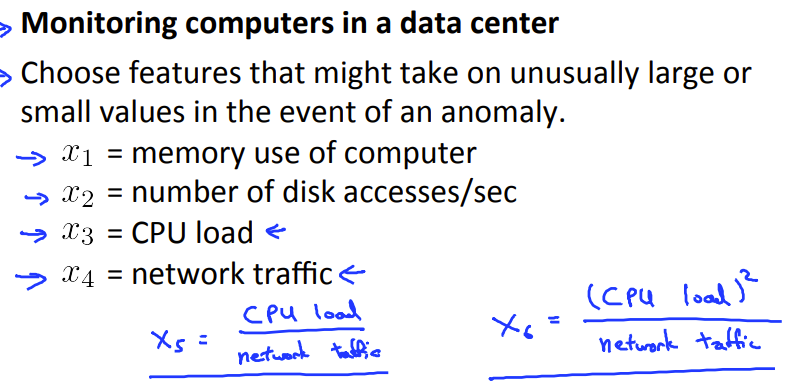
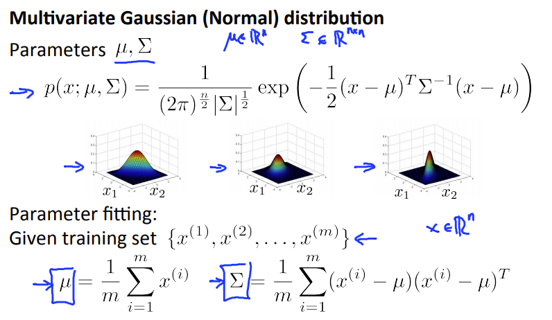

## Anomaly detection

### Gaussian distribution

关于高斯分布的一场函数检测。大体来说就是当数据出现的概率很小时，判断为一次不正常的数据


> 分析一个数据时，这个特征向量包括很多的特征，最后的概率为每个特征概率的连乘，再用最后的结果与选用的sigma进行对比，判断是否为异常

其中高斯分布的函数可以用数据集的数值来估计

```octave
function [mu sigma2] = estimateGaussian(X)
[m, n] = size(X);
mu = zeros(n, 1);
sigma2 = zeros(n, 1);

mu = 1/m*sum(X)';

sigma2 = 1/m*sum((X-mu').^2)';

end

```

### Developing and evaluating an anomaly detection system

- 数据集将分为三个部分，训练集，验证集，测试集
- 训练集的没有加入标签，单纯训练高斯分布
- 其他俩个训练集和F1分数用来评价训练模型以及一些参数

```octave
pval = multivariateGaussian(Xval, mu, sigma2);
function [bestEpsilon bestF1] = selectThreshold(yval, pval)
%SELECTTHRESHOLD Find the best threshold (epsilon) to use for selecting
%outliers
%   [bestEpsilon bestF1] = SELECTTHRESHOLD(yval, pval) finds the best
%   threshold to use for selecting outliers based on the results from a
%   validation set (pval) and the ground truth (yval).
bestEpsilon = 0;
bestF1 = 0;
F1 = 0;

stepsize = (max(pval) - min(pval)) / 1000;
for epsilon = min(pval):stepsize:max(pval)
    predictions=(pval<epsilon);
    tp=sum((predictions==1)&(yval==1));
    fp=sum((predictions==0)&(yval==1));
    fn=sum((predictions==1)&(yval==0));
    prec=tp/(tp+fp);
    rec=tp/(tp+fn);
    F1=2*prec*rec/(prec+rec);
    if F1 > bestF1
       bestF1 = F1;
       bestEpsilon = epsilon;
    endif
endfor
end

```

### Anomaly detection vs supervised learning

使用异常检测的时候

>1.非常少的正值数据和很多的负值数据
>
>2.很多特征都能代表分别的不正常，学习算法很难分清具体的异常是什么
>
>3.以后的异常可能与现在训练所用的数据集完全没什么一样的
>
>4.Fraud检测
>
>5....

监督学习的时候

> 1.同时拥有非常大的正值数据和负值数据
>
> 2.拥有足够的正值数据来训练模型使之能预测出来，且将来需要预测得出的结果和训练集相似
>
> 3.垃圾邮件分类
>
> 4...

### Choosing what features to use

当然，我们的数据分布可能不为高斯分布，这个时候就可以使用函数来伸缩数据


当面对误差分析的时候，我们希望关于正常的预测可能性都很大，关于异常的预测可能性都很小，但更普遍的情况是两种情况都差不多



### Multivariate Gaussian distribution

根据上述多向量的高斯函数的特点，不难发现，多个特征汇集一起的正常范围是一个"球"，而实际上的正常范围可能更倾向于椭圆之类的

有个解决方法就是，高维高斯函数




## Recommender Systems

```octave
function [J, grad] = cofiCostFunc(params, Y, R, num_users, num_movies, 
                                  num_features, lambda)
%COFICOSTFUNC Collaborative filtering cost function
%   [J, grad] = COFICOSTFUNC(params, Y, R, num_users, num_movies, ...
%   num_features, lambda) returns the cost and gradient for the
%   collaborative filtering problem.
%

% Unfold the U and W matrices from params
X = reshape(params(1:num_movies*num_features), num_movies, num_features);
Theta = reshape(params(num_movies*num_features+1:end), 
                num_users, num_features);

            
% You need to return the following values correctly
J = 0;
X_grad = zeros(size(X));
Theta_grad = zeros(size(Theta));

predict=(X*Theta') .* R;
J=1/2*sum(sum((predict-Y) .^ 2))+lambda/2*sum(sum(Theta .^ 2))+lambda/2*sum(sum(X .^ 2));
%Y in which there is no conmment is equal to 0
for i=1:num_movies
    idx=find(R(i,:)==1);
    Thetatemp=Theta(idx,:);
    Ytemp=Y(i,idx);
    X_grad(i,:)=(X(i,:)*Thetatemp'-Ytemp)*Thetatemp+lambda*X(i,:);
end

for i=1:num_users
    idx=find(R(:,i)==1);
    Xtemp=X(idx,:);
    Ytemp=Y(idx,i);
    Theta_grad(i,:)=(Xtemp*Theta(i,:)'-Ytemp)'*Xtemp+lambda*Theta(i,:);
end
grad = [X_grad(:); Theta_grad(:)];

end

```


